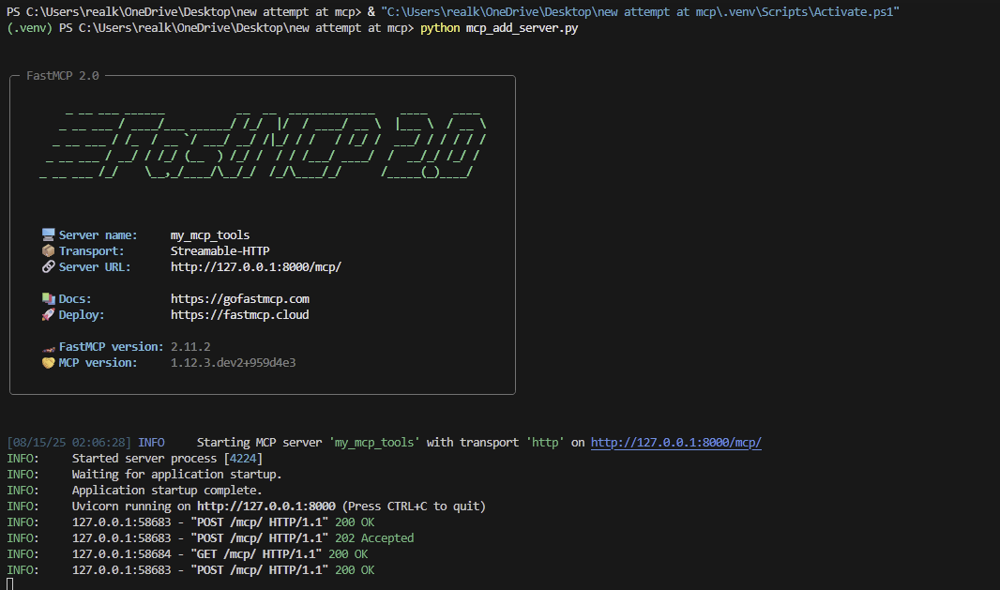
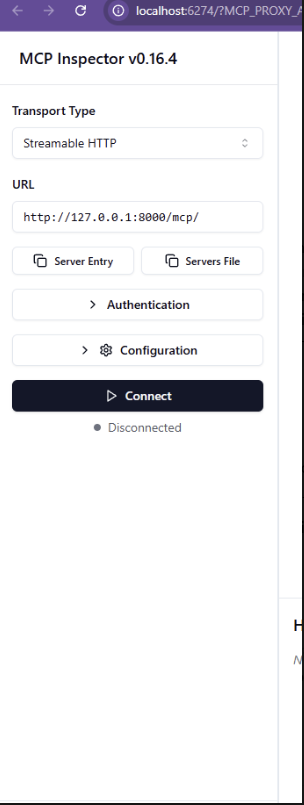
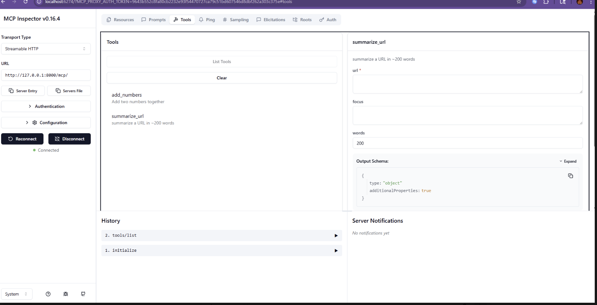
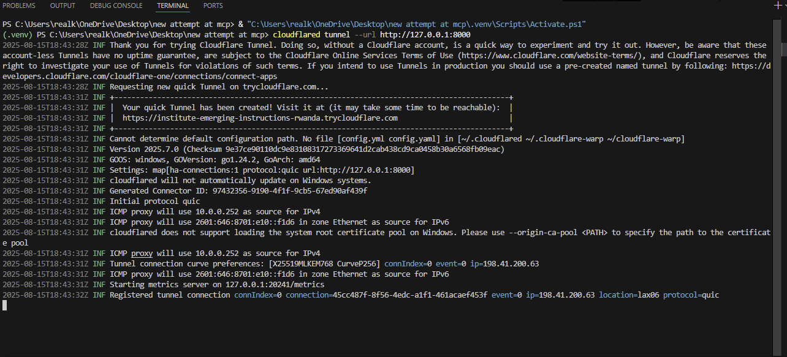
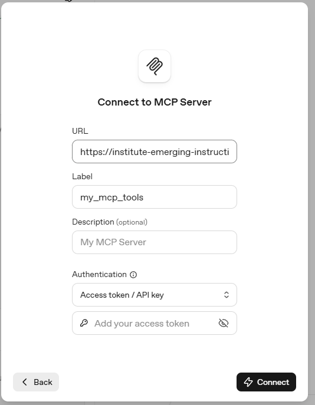
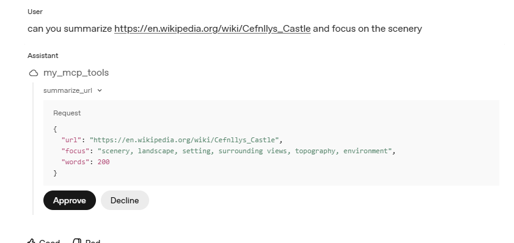

[# MCP Server Tutorial

## Introduction
In this guide, you’ll learn how to set up and run an MCP (Model Context Protocol) server with your own tools.
The two example tools here are:
- `add_numbers` → adds two numbers together
- `summarize_url` → fetches a webpage, cleans the text, and summarizes it using an AI API call

Once your server is working, you can swap in any tools you like.

---

## Prerequisites
- Python 3.10+
- Git installed
- [FastMCP](https://pypi.org/project/fastmcp/)
- [Requests](https://pypi.org/project/requests/)
- [BeautifulSoup4](https://pypi.org/project/beautifulsoup4/)
- [Readability-lxml](https://pypi.org/project/readability-lxml/)
- `openai` Python package and an OpenAI API key (model: `gpt-4o`)
- (Optional) [cloudflared](https://developers.cloudflare.com/cloudflare-one/connections/connect-apps/install-and-setup/installation/) for tunneling

---

## Step 1: Clone the Repository
```bash
git clone https://github.com/<your-username>/<your-repo>.git
cd <your-repo>
```

---


## Step 2: Create a Virtual Environment and Install Dependencies
```bash
python -m venv .venv
# macOS/Linux:
source .venv/bin/activate
# Windows (PowerShell):
# .\.venv\Scripts\Activate.ps1

pip install -r requirements.txt
```

**requirements.txt**
```
fastmcp
requests
beautifulsoup4
readability-lxml
openai
lxml
```

---

## Step 3: Configure the Server
Set your OpenAI API key via environment variable (recommended):

```bash
# macOS/Linux
export OPENAI_API_KEY="sk-..."
# Windows (PowerShell)
setx OPENAI_API_KEY "sk-..."
```

In `add_server.py`, ensure you havew a format such as this one:
```python
MODEL = "gpt-4o"
HOST = "127.0.0.1"
PORT = 8000
TRANSPORT = "http"  # or "stdio"
```

When `TRANSPORT="http"`, your server listens on:
```
http://127.0.0.1:8000
```

---

## Step 4: Run the Server
```bash
python add_server.py
```
  
*Figure 1: MCP server output showing FastMCP 2.0 running locally*  


---

## Step 5: Debug with MCP Inspector (No Tunneling Needed)
Use the official Inspector to test tools locally.

```bash
npx @modelcontextprotocol/inspector
```
  
*Figure 2: MCP inspector loading page*


**Connect settings:**
- **Transport Type:** `Streamable HTTP`
- **URL:** `http://127.0.0.1:8000/mcp/`

> Connect **only while your Python server is running**.

You’ll see your tools (`add_numbers`, `summarize_url`) and can run them with custom inputs.
  
*Figure 3: MCP inspector listing server tools*


---

## Step 6: Put the Server Online with Cloudflared (Optional)
If you want to share your local server:

```bash
cloudflared tunnel --url http://127.0.0.1:8000
```
  
*Figure 4: cloudflare tunnel and link established*


Cloudflared prints a public URL like:
```
https://<random>.trycloudflare.com
```

**Important:** When using this URL in clients, **append `/mcp/`**:
```
https://<random>.trycloudflare.com/mcp/
```

Keep **both** the Python server **and** cloudflared running while testing.

---

## Step 7: Add the Server to OpenAI Chat
1. Open OpenAI Chat (Models page) → MCP settings
2. **Add MCP Server**
3. Enter:
   - **URL:** your Cloudflare URL **with `/mcp/` appended**
   - **Label:** `my_mcp_tools` (must match your server’s `FastMCP(name="my_mcp_tools")`)
4. Connect while the server and tunnel are running

### Auto tool use from chat
Once connected, the model can propose calling your tools based on your prompt and will ask for confirmation before running.

Example prompt:
> Summarize https://en.wikipedia.org/wiki/Cefnllys_Castle and focus on the scenery.

  
*Figure 5: Input name of server and cloudflare tunnel link*


  
*Figure 6: LLM requests to use tool*


---

## Step 8: Tool Descriptions
- **add_numbers(x, y)** → returns `{"result": x + y}`
- **summarize_url(url, focus="", words=200)** → fetches, cleans, and summarizes a page; optional focus string and desired word count

---


## Step 9: Troubleshooting
- **Inspector can’t connect** → check Transport Type, URL (`/mcp/`), and that the server is running.
- **Tunnel issues** → start the Python server **before** `cloudflared`.
- **`fetch_failed`** → verify the URL and your network.
- **`llm_failed`** → ensure `OPENAI_API_KEY` is set and `MODEL` is valid.
- **Chat not connecting** → confirm tunnel URL ends with `/mcp/` and label matches `my_mcp_tools`.

---

## Final Notes
This tutorial gets **your own MCP server and tools running**. The key is a reliable **server backbone** and a clear **debugging process** (Inspector + tunneling).
From here, customize freely: add, remove, or modify tools to fit your use case.
](https://github.com/realkidpyro/mcp-tutorial/tree/main/pictures)
